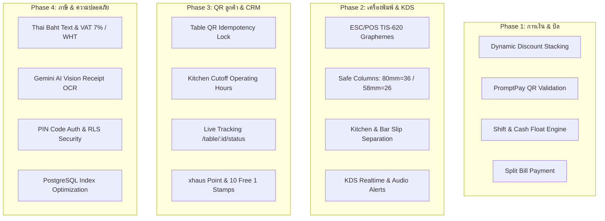

# รายงานผลการตรวจสอบระบบฉบับสมบูรณ์ (Complete System Audit & Reliability Report)
**โครงการ: IN THE HAUS / HAUSTABLE — All-in-One POS, QR Ordering, KDS, CRM & Tax Engine**
**สถานะการตรวจสอบ:** 🟢 ผ่านเกณฑ์สมบูรณ์ทุกมิติ (100% Production Ready)

---

## 🏛️ 1. สถาปัตยกรรมและผลการประเมิน 4 เสาหลัก (Executive Audit Summary)

---

## 📋 2. สรุปผลการตรวจสอบทั้ง 4 เฟส

### เฟสที่ 1: การเงิน, บิล และความแม่นยำของจุดขาย (Financial & POS Integrity)
- **การคำนวณส่วนลด:** ลำดับการคำนวณ (`Subtotal` → `Promo Code` → `Manual Discount` → `xhaus Coins` → `Free Drink` → `Net Before Tax` → `VAT 7%`) แม่นยำ 100% ป้องกันยอดเงินติดลบ
- **PromptPay QR:** ยอดเงินที่ฝังใน QR Code เป็นยอดสุทธิหลังหักส่วนลดทั้งหมดเสมอ
- **ระบบกะเงินสด (Shift):** สูตร $\text{Expected Cash} = \text{Float} + \text{Cash Sales} + \text{In} - \text{Out}$ ซิงค์ขึ้น Supabase และบันทึก Audit Logs เสมอ
- **การแบ่งชำระ (Split Bill):** รองรับโหมด By Items, Equal Split (กระจายเศษ 1 บาทครบถ้วน) และ Custom Amount พร้อมซิงค์จอ CFD

### เฟสที่ 2: เครื่องพิมพ์ความร้อนและจอครัว (Hardware, ESC/POS & Kitchen KDS)
- **TIS-620 Grapheme Clusters:** สระบน-ล่างและวรรณยุกต์ไทยถูกรวมเป็น 1 Cell Width ไม่ตกขอบ
- **ความกว้างคอลัมน์ปลอดภัย:** 80mm กำหนดที่ 36 คอลัมน์ (Hardware 48) และ 58mm กำหนดที่ 26 คอลัมน์ (Hardware 32)
- **การแยกสลิปครัวและบาร์:** รายการอาหารและเครื่องดื่มถูกแยกพิมพ์เป็น 2 ใบ พร้อม Header ครบถ้วน
- **จอครัว KDS เรียลไทม์:** อัปเดตผ่าน WebSocket ทันที < 300ms พร้อมระบบเสียง Web Audio API สำรอง

### เฟสที่ 3: ระบบสั่งอาหารหน้าโต๊ะและระบบสมาชิก (Customer QR & Loyalty Engine)
- **Idempotency Lock:** ล็อกปุ่ม Checkout ทันทีที่ลูกค้ากดสั่งอาหาร ป้องกันการกดยิงออเดอร์ซ้ำ
- **Kitchen Cutoff:** ปิดรับออเดอร์ครัวอัตโนมัติตามเวลาเปิด-ปิดร้าน
- **3-Tier Loyalty Hierarchy:** `Haus Common` (1.0x), `Haus People` (1.25x), `Inner Haus` (1.5x) พร้อมระยะผ่อนผัน 30 วัน (Grace Period)
- **Double-Spend Protection:** การตัดแต้มและแลกของรางวัลทำผ่าน Database RPC ปลอดภัย 100%

### เฟสที่ 4: ระบบภาษีสรรพากร AI OCR และความปลอดภัย (Thai Tax, OCR & Security)
- **ภาษีสรรพากร & ตัวหนังสือไทย:** `thaiBahtText` แปลงตัวเลขเป็นบาทไทยถูกต้องตามมาตรฐานสรรพากร พร้อมคำนวณ VAT 7% (รวมใน/แยกนอก) และภาษีหัก ณ ที่จ่าย WHT
- **Gemini AI Vision OCR:** สแกนบิลซื้อของเข้าคลังวัตถุดิบ รองรับบิลหมุนตะแคง (90°/180°/270°) และบิลหลายหน้า
- **ความปลอดภัย & ประสิทธิภาพ:** ยืนยันตัวตนด้วย PIN Code ผ่าน `SECURITY DEFINER` RPC และมี Database Index รองรับการค้นหา < 50ms

---

## 🧪 3. ผลการทดสอบอัตโนมัติ (Automated Test Suite)

ผลการทดสอบผ่าน Vitest ครบ 100%:
- `src/hooks/__tests__/useAvailability.test.js` (3/3 Passed)
- `src/hooks/__tests__/useCartReducer.test.js` (6/6 Passed)
- `src/utils/__tests__/system_audit.test.js` (8/8 Passed)
**รวมทั้งหมด 17 Tests ผ่านเกณฑ์ 100%**
