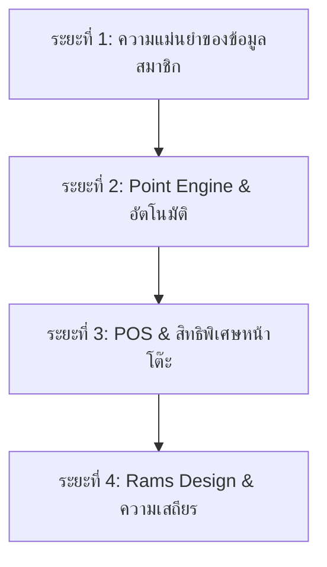

# แผนพัฒนาและปรับปรุงระบบสมาชิกอย่างสมบูรณ์ (System Roadmap)
**IN THE HAUS — CRM & RELATIONS SYSTEM**

เอกสารฉบับนี้สรุปการตรวจสอบระบบสมาชิกปัจจุบัน (Member Card Verification) และวางแผนพัฒนา (Roadmap) ระบบงานฟังก์ชันต่างๆ ทั้งหมดของโครงการ **In The Haus** เพื่อนำไปปรับปรุงและต่อยอดระบบให้มีเสถียรภาพและประสบการณ์การใช้งานในระดับพรีเมียม (Premium Tactile Rams Experience)

---

## 🔍 1. รายงานการตรวจสอบและการแก้ไขล่าสุด (Details & Design Verified)
เราได้ทำการตรวจสอบและปรับปรุงระบบการเก็บข้อมูลโปรไฟล์ของระบบสมาชิกตามตารางโครงสร้างฐานข้อมูล (Rams DB Schema) และปรับปรุงดีไซน์หน้า Member Card ดังนี้:

| ฟิลด์ข้อมูล | สถานะการจัดเก็บ (DB) | สถานะหน้า Member Card | การสมัครผ่าน LINE (LIFF) | การแก้ไขจากหน้าแอดมิน |
| :--- | :---: | :---: | :---: | :---: |
| **ชื่อจริง (display_name)** | ✅ มีในระบบ | ✅ แสดงผล | ✅ กรอกลงทะเบียนได้ | ✅ แก้ไขได้ |
| **ชื่อเล่น (nickname)** | ✅ มีในระบบ | ✅ แสดงผล (ใหม่) | ✅ กรอกลงทะเบียนได้ (ใหม่) | ✅ แก้ไขได้ (ใหม่) |
| **เบอร์มือถือ (phone_number)** | ✅ มีในระบบ | ✅ แสดงผล / ทำ QR | ✅ กรอกลงทะเบียนได้ | ✅ แก้ไขได้ |
| **วันเกิด (birth_day / month)**| ✅ มีในระบบ | ✅ แสดงผล (ใหม่) | ✅ เลือกวันเกิดได้ (ใหม่) | ✅ แก้ไขได้ (ใหม่) |
| **เพศ (gender)** | ✅ มีในระบบ | ✅ แสดงผล (ใหม่) | ✅ เลือกเพศได้ (ใหม่) | ✅ แก้ไขได้ (ใหม่) |
| **LINE ID (line_user_id)** | ✅ มีในระบบ | ✅ เชื่อมต่ออัตโนมัติ | ✅ เก็บ Token เข้าระบบ | ✅ แก้ไขระบุค่าตรงได้ |

### การปรับเปลี่ยนสไตล์หน้า Member Card (Dieter Rams Aesthetic Refined):
- **ธีมสีกล่องวิทยุ Braun**: ปรับสีพื้นหลังหน้าจากเหลือง/น้ำตาล Gradient เป็นเทาอุ่น `var(--color-hallmark-paper)` และสีตัวหนังสือเข้มเป็นตัวแปรถนอมสายตา `var(--color-hallmark-ink)`
- **บัตรสมาชิกดิจิตอล (Mechanical Cards)**: ดีไซน์บัตรทั้ง 3 ระดับสมาชิก (Common, People, Inner Haus) ใหม่หมดจด โดยใช้ลักษณะสีกล่องเครื่องใช้ไฟฟ้าและหน้าปัดควบคุม พร้อมไฟ LED บอกสถานะ (Active System) ตัวหนังสือใช้ Font `Space Mono` สำหรับข้อมูลตัวเลขและรหัสบัตร
- **เพิ่มระบบแก้ไขข้อมูลโปรไฟล์ด้วยตนเอง (Self-Service Profile Edit)**: สมาชิกสามารถกดปุ่ม "Edit Info" เพื่อแก้ไข ชื่อเล่น ชื่อจริง เพศ เบอร์มือถือ หรือวันเกิดได้โดยตรงจากหน้าบัตร จากนั้นระบบจะยิงคำสั่งอัพเดทไปยังตาราง `profiles` ใน Supabase อย่างปลอดภัยตามข้อกำหนดสิทธิ์ RLS (Row Level Security)

---

## 🗺️ 2. แผนพัฒนา Roadmap ระบบและฟังก์ชันต่างๆ (System Roadmap)

แผนงานพัฒนาปรับปรุงระบบเพื่อให้การทำงานเชื่อมต่อกันระหว่างหน้าโต๊ะสั่งอาหาร (Customer Table Ordering), ระบบแคชเชียร์พนักงาน (POS Dashboard), ระบบหลังบ้าน (Admin Panel) และบอทไลน์ (LINE Bot Webhook) สมบูรณ์แบบ แบ่งออกเป็น 4 ระยะหลัก:

---

### ⏳ ระยะที่ 1: ความแม่นยำของข้อมูลและระบบสมัครสมาชิก (Data Integrity & Auth)
*เป้าหมาย: ตรวจสอบความถูกต้องของการสมัครสมาชิกในทุกกรณี ป้องกันการกรอกข้อมูลซ้ำซ้อน*
1. **การตรวจสอบเบอร์โทรศัพท์ซ้ำซ้อน (Phone Number Duplicate Check)**:
   - ปรับปรุง Edge Function `manage-booking` ให้เช็คหมายเลขโทรศัพท์ก่อนบันทึกเสมอ หากมีผู้ใช้อื่นในระบบใช้เบอร์นั้นไปแล้ว ให้ปฏิเสธและแสดงข้อความแจ้งเตือนที่เข้าใจง่ายบนหน้าจอสมัครสมาชิก
2. **การกู้คืนและเชื่อมต่อบัญชีอัตโนมัติ (LINE Sync Repair)**:
   - พัฒนาระบบตรวจสอบในหน้าลงทะเบียน LINE เผื่อกรณีลูกค้าเคยลงทะเบียนด้วยเบอร์โทรศัพท์มาก่อนแล้วต่อมาต้องการกดเข้ากลุ่ม LINE ให้ทำการเชื่อมบัญชีเก่า (Link Auth User) โดยใช้ฟังก์ชันเช็คประวัติจากเบอร์โทรศัพท์ แทนการสร้างโปรไฟล์ซ้ำตัวใหม่
3. **การล้างฟิลด์ขยะในโปรไฟล์ (DB Schema Cleanup)**:
   - ทำการย้ายข้อมูลและล้างคอลัมน์ซ้ำซ้อนในตาราง เช่น `line_uid` และ `line_user_id` ให้เหลือเพียงฟิลด์เดียวที่ตกลงร่วมกัน เพื่อป้องกันการเขียนและสืบค้นผิดช่อง

---

### 🪙 ระยะที่ 2: ระบบคิดเหรียญอัตโนมัติและการให้ของขวัญ (Point Engine & Automation)
*เป้าหมาย: ใช้ประโยชน์จากข้อมูลวันเกิด และยอดใช้จ่ายสะสมเพื่อขับเคลื่อนโปรโมชันอัตโนมัติ*
1. **ระบบมอบของขวัญวันเกิดอัตโนมัติ (Birthday Perk Engine)**:
   - พัฒนาระบบหลังบ้าน (Edge Function หรือ Cron Job) ตรวจสอบฐานข้อมูลสมาชิกที่มีวันและเดือนเกิดตรงกับวันที่ปัจจุบัน จากนั้นมอบเหรียญสะสมพิเศษ (เช่น 50 xhaus) หรือส่งคูปองผ่านไลน์กลุ่มของลูกค้าท่านนั้นโดยอัตโนมัติ
2. **การคำนวณและปรับเปลี่ยนระดับสมาชิกสะสม (Cache Loyalty Tier on Profile)**:
   - เนื่องจากปัจจุบันระดับสมาชิกสะสมคำนวณผ่าน RPC ทุกครั้งที่มีการเปิดหน้าเว็บ หากผู้ใช้งานมีจำนวนมากและประวัติการบิลมียอดหนาแน่น จะส่งผลให้ระบบดึงข้อมูลช้าลง
   - พัฒนา Trigger บนตาราง `bookings` ให้ปรับปรุงระดับสมาชิกและตัวคูณแต้ม (`current_tier`, `multiplier`) ลงไปบันทึกไว้เป็นคอลัมน์เก็บถาวรในตาราง `profiles` ทันทีเมื่อบิลของลูกค้ารายนั้นเปลี่ยนสถานะเป็น `completed`
3. **ระบบสิทธิ์ผ่อนผันระดับสมาชิกรักษาใจ (Grace Period Automation)**:
   - พัฒนาระบบลดเกรดสมาชิกแบบยุติธรรม หากครบ 12 เดือนแล้วยอดสะสมไม่ถึง แต่ร้านตรึงสิทธิ์ให้ต่ออีก 30 วัน เมื่อพ้นช่วงผ่อนผัน 30 วันแล้ว (Grace Period Expired) ระบบจะลดเกรดกลับมาตามระดับจริงโดยอัตโนมัติ

---

### 🍽️ ระยะที่ 3: การสั่งอาหารและเช็คบิลที่ POS (POS Integration & Client Flow)
*เป้าหมาย: การใช้งานคะแนนและระบบสมาชิก ณ จุดชำระเงินที่ร้านอย่างสมบูรณ์แบบ*
1. **การเชื่อมสมาชิกเข้ากับคำสั่งซื้อหน้าโต๊ะ (Attach Member to POS Order)**:
   - แคชเชียร์สามารถสแกน QR Code จากหน้า Member Card ของลูกค้า หรือค้นหาด้วยเบอร์โทรศัพท์/ชื่อเล่น เพื่อนำโปรไฟล์ไปผูกกับหมายเลขโต๊ะในเครื่องแคชเชียร์
2. **ระบบสิทธิประโยชน์ตามระดับสมาชิก (Dynamic Tier Perks & Multipliers)**:
   - *นโยบายปัจจุบัน*: **ปิดส่วนลดเป็น % ตาม Tier ไว้** (เนื่องจากไม่มีนโยบายแจกส่วนลด % ตาม Tier บิลในปัจจุบัน)
   - *สิทธิประโยชน์หลัก*: ให้สิทธิประโยชน์ผ่าน **ตัวคูณแต้มสะสม xhaus (Point Multiplier)** แทน:
     - *Common*: ตัวคูณแต้ม 1.0 เท่า (ทุก 100 บาท = 1 xhaus)
     - *People*: ตัวคูณแต้ม 1.25 เท่า (ทุก 100 บาท = 1.25 xhaus)
     - *Inner Haus*: ตัวคูณแต้ม 1.5 เท่า (ทุก 100 บาท = 1.5 xhaus)
   - *สถาปัตยกรรมระบบ*: พัฒนาฟังก์ชัน `calculateTierDiscount` รองรับโครงสร้างส่วนลดไว้ล่วงหน้า โดยปิดการทำงานเป็นค่าเริ่มต้น (`crm_enable_tier_discount = false`) หากในอนาคตมีนโยบายเปิดใช้งาน สามารถเปิดจากหน้าตั้งค่าได้ทันทีโดยไม่ต้องรื้อโค้ดใหม่
3. **ระบบการแลกแต้มแทนเงินสด (Secure Point Redemption)**:
   - ลูกค้าสามารถระบุจำนวนเหรียญ xhaus ที่ต้องการแลกเป็นส่วนลดแทนเงินสด (1 xhaus = 1 บาท) โดยระบบหลังบ้านจะหักคะแนนออกจากกระเป๋าของลูกค้าทันทีผ่านคำสั่งธุรกรรม (Database Transaction) เพื่อป้องกันปัญหายอดแต้มติดลบ (Double Spend Protection)

---

### 🎨 ระยะที่ 4: มาตรฐานการดีไซน์ Dieter Rams และระบบตรวจสอบล้มเหลว (Standardization & Resilience)
*เป้าหมาย: ปรับปรุงการออกแบบ UI/UX ให้เชื่อมโยงเป็นอันหนึ่งอันเดียวกัน สไตล์เรียบง่าย น่าเชื่อถือ*
1. **การนำ CSS Variables ไปปรับใช้ในทุกหน้า (Global Rams Layout)**:
   - ปรับปรุงสไตล์ของส่วนประกอบอื่นๆ เช่น หน้าสั่งอาหาร [CustomerOrderLanding.jsx](file:///c:/Users/Ritha/inthehaus-booking/src/pos/CustomerOrderLanding.jsx), หน้าติดตามคิว [TrackingPage.jsx](file:///c:/Users/Ritha/inthehaus-booking/src/TrackingPage.jsx) และบอร์ดครัว/สตาฟให้หันมาใช้ระบบตัวแปรสี `oklch` และมุมมน `rounded-rams` ตามหลัก Dieter Rams เพื่อความเป็นอันหนึ่งอันเดียวกันของโปรเจกต์
2. **ระบบการจัดการข้อผิดพลาดเมื่อฐานข้อมูลขัดข้อง (Database Offline Resilience)**:
   - พัฒนาระบบบันทึกข้อมูลสิทธิประโยชน์ลง Local Storage ในกรณีที่การเชื่อมต่ออินเทอร์เน็ตหลุดขัดข้อง เพื่อให้แคชเชียร์ยังคงสามารถให้ส่วนลดตามระดับสมาชิกล่าสุดที่เครื่องจดจำได้
3. **ระบบแจ้งเตือนผ่านบอทไลน์ (LINE Bot Push Notification)**:
   - เมื่อมีการชำระเงินสำเร็จ แคชเชียร์จะส่งคำสั่ง Push Message เข้าไลน์ส่วนตัวของลูกค้าเพื่อแจ้งยอดสะสมที่ได้รับจากมื้ออาหารและยอดเหรียญสะสมคงเหลือล่าสุดทันทีแบบเรียลไทม์
